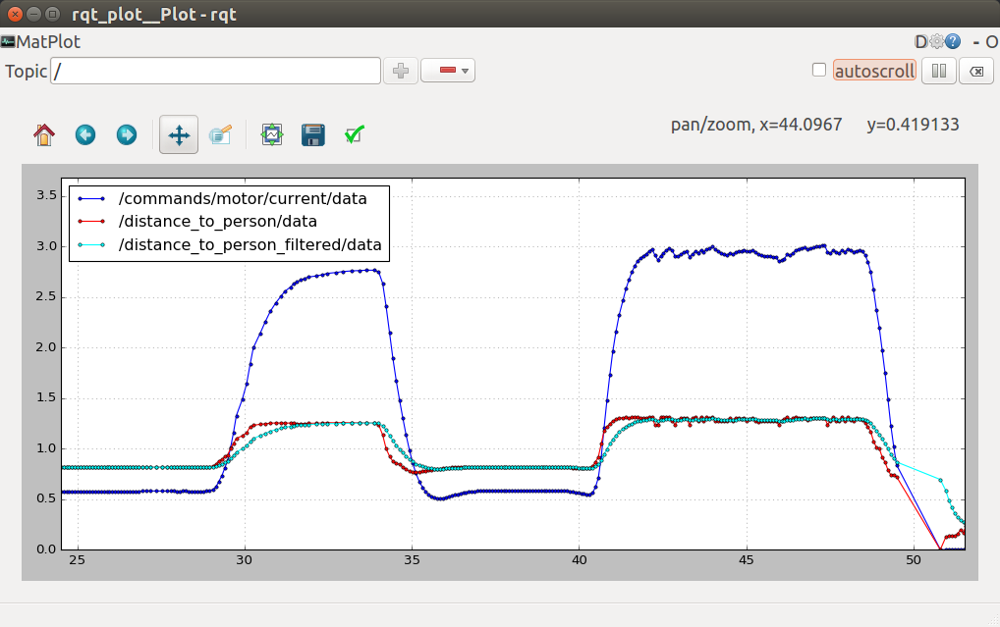

# Yolo Depth Measurement

This package determines the distance to a person. It subscribes the the bounding boxes output by Yolo and the depth image from the Zed camera and calculates the distance to the person from the centroid of the bounding box.

To make the readings more robust, 2 techniques are used:
- Distance is averaged from 10x10px around the centroid of the bounding box.
- The distance reading may be noisy. It is filtered using an exponential moving average.

There are 2 implementations of an exponential moving average filter in the code, any one may be used. They are both first order filters with similar performance:
- The simplest filter is called `moving average` or `ma` in the code. It has the formula:
```
new_filterOutput = (1-percentage_weightage)*old_filterOutput + (percentage_weightage)*nextElement
```

- The other is called `Exponential Moving Average` or `ema` in code, calculated with a time constant.
```
new_filterOutput = old_filterOutput + (T/Tf)*(nextElement - old_filterOutput)
```


### Steps to execute:
Launch the driver :
```
$ rosrun yolo_depth_measure yolo_depth_measure.py
```