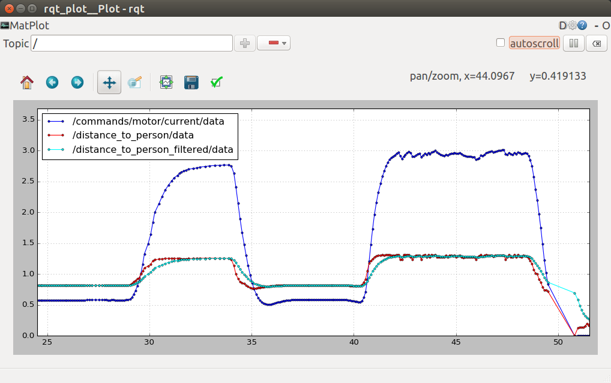
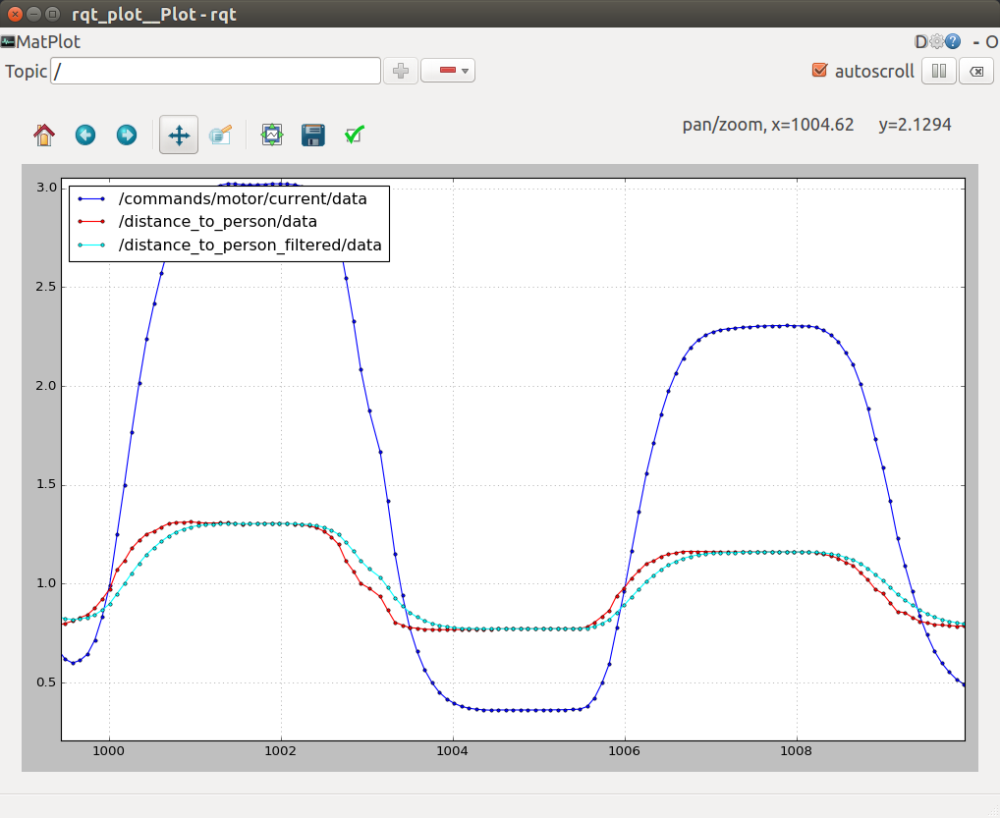

# Yolo Depth Measurement

## Depth Measurement
This package determines the distance to a person. It subscribes the the bounding boxes output by Yolo and the depth image from the Zed camera and calculates the distance to the person from the centroid of the bounding box.

To make the readings more robust, 2 techniques are used:
- Distance is averaged from 10x10px around the centroid of the bounding box.
- The distance reading may be noisy. It is filtered using an exponential moving average.

There is an implementations of an Exponential Moving Average filter in the code. It is a first order filter with the formula:
```
new_filterOutput = old_filterOutput + (weight)*(nextElement - old_filterOutput)

# weight is a value between (0,1). A value of 1 disables the filter, passing the raw inputs as outputs.
```




### Steps to execute:
Launch the driver :
```
$ rosrun yolo_depth_measure yolo_depth_measure.py
```

## Object Tracking
Objects are detected by our deep learning algorithm and bounding boxes are generated for each detection. We need to track our target to follow. For this purpose, we use [SORT](https://arxiv.org/pdf/1602.00763.pdf) ([code](https://github.com/Shreeyak/sort)). To see more info, check out [tracking.md](./tracking.md).

### SORT Dependencies
As seen in the readme, `sort` has some dependencies to be installed:
- scipy
- filterpy==1.4.1
- numba==0.38.1
- scikit-image==0.14.0
- scikit-learn==0.19.1

#### Scipy and FilterPy Install
```
$ sudo apt-get install python-scipy
$ sudo pip install filterpy
```

#### Numba Install
Installing `numba` via `pip install numba` did not work on the TX2. There are problems with `llvmlite`:
```
RuntimeError: Building llvmlite requires LLVM 6.0.x. Be sure to set LLVM_CONFIG to the right executable path.
```
According to the errors, llvmlite requires `LLVM 6.0`. However, installing LLVM from the package manager does not solve the issue on Jetson TX2 and needs to be built from source.

##### Build LLVM
You can read more about building llvm from source [here](http://ai.sensilab.monash.edu/2018/08/31/Jetson-speech/), [here](https://gist.github.com/jed-frey/ba40ff83523296bc8355f05befb28da9) and [here](http://www.athenian-robotics.org/jetsontx2/).


1. Download the sources from here: http://www.linuxfromscratch.org/blfs/view/svn/general/llvm.htmld

Full build is around 29Gb, not enough space in inbuilt memory on TX2. However, by passing the flags as shown below, the build size can come down to 1.3Gb.

2. Make a "build" directory inside the llvm source directory and from the build directory, run cmake:
```
$ cd llvm-6.0.1.src
$ mkdir build
$ cd build

# Configure to build only the Release version and only for the ARM, x86 and AArch64 architectures
$ cmake .. -DCMAKE_BUILD_TYPE=Release -DLLVM_TARGETS_TO_BUILD="ARM;X86;AArch64"

#Start the build from the build directory
$ cmake -j4 --build .
```
This is compile the package. It should take around 3hrs or more.

3. Install llvm:
```
#install it from the build directory:
$ sudo cmake --build . --target install
```

LLVM will be installed to: `/usr/local/include/llvm`

***To check - install llvm from package manager***
As per this [post](https://askubuntu.com/questions/576510/error-while-trying-to-install-llvmlite-on-ubuntu-14-04), it might be an issue with symbolic links.


##### Install numba
Now numba can be installed from pip:
```
$ sudo pip install -v numba
```


### Scikit Install
Trying `pip install -v scikit-image` fails with the error:
```
Cython >= 0.23 not found
```
Let's install Cython; be warned, it's going to take a while, maybe 30min:
```
$ sudo -H pip install -v cython
```
We can now install scikit:
```
$ sudo -H pip install -v scikit-image
$ sudo -H pip install -v scikit-learn
```

### Upgrading Numpy
You may need to upgrade numpy after this, I got the error: `RuntimeError: module compiled against API version 0xc but this version of numpy is 0xa`. Run:
```
$ sudo -H pip install -U -v numpy
```


---

### Problems with Pip
Some tips in case there are problems with pip.
In case pip install gets stuck after downloading whl file at `setup.py` step, try this command (may want to use `-v` or `sudo -H`):
```
$ pip install --upgrade setuptools
$ pip install --upgrade pip
```
For major issues, try downgrading pip:
```
$ sudo pip install --upgrade pip==9.0.3
```
